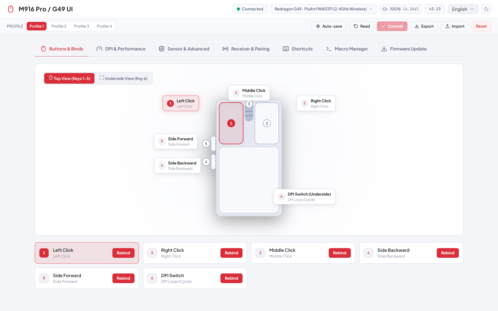
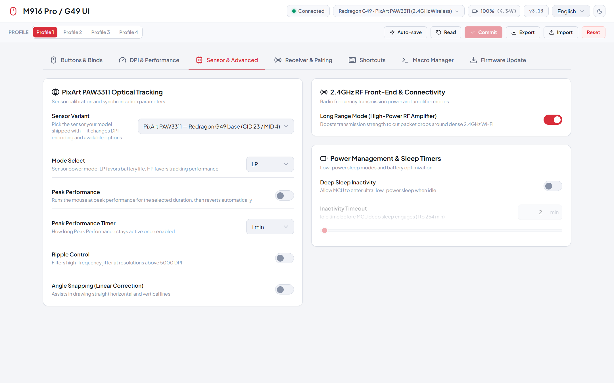

# M916 Pro / G49 UI

WebHID control center for the **Redragon G49 base** and the **Redragon M916 Pro** gaming mouse (1K and 4K).

**English** | [中文](README.zh-CN.md)

<p align="center">
  
  
</p>

## Supported models

| Model | Sensor | USB ID (VID:PID) | Board MID |
| --- | --- | --- | --- |
| Redragon G49 base | PixArt **PAW3311** | `3554:F55D` (2.4G dongle) / `3554:F5D5` (alt dongle) / `3554:F55E` (wired) | 4 |
| M916 Pro 1K | PixArt **PAW3395** | same 1K PIDs as above | 5 |
| M916 Pro 4K | PixArt **PAW3395** | `3554:F54C` / `3554:F54F` / `3554:F55F` / `3554:F54E` | 6 |

Both G49 and M916 Pro 1K share the same 1K USB IDs but use different sensors and board identities. The connected model is detected automatically (live MID read → PID table → flash-encoding evidence, in that order) and can also be switched manually via the Sensor panel.

## Features

- **Button mapping:** Rebind any of the six hardware buttons to mouse actions, DPI switching, rapid fire, multimedia keys, shortcuts or macros
- **DPI & polling:** 1-8 DPI stages, per-stage colors, live stage switching, polling rate from 125 Hz to 4 kHz
  - PAW3395 (M916 Pro): linear register codes, 50-26,000 DPI
  - PAW3311 (G49): quantized register table 50-10,000 DPI with x2/x4 scaling up to 24,000 DPI, matching the official G49 driver's `driver_sensor.h`
- **Sensor tuning:** Ripple control and angle snapping on both sensors; motion sync and MTK surface calibration on PAW3395 models only (hidden on the G49, where the registers are firmware placeholders); peak-performance block on the G49 (toggle, 30 s – 40 min timer, LP/HP sensor mode)
- **Power & RF:** Long-range mode, power saving, sleep timers
- **Connection UX:** Click the device-info badge in the header to switch between receivers / the wired link (reload always reconnects the last-used device silently); mouse + receiver firmware versions are read live on the 2.4G link; optional auto-save commits changes ~2 s after you stop editing
- **Macros & shortcuts:** Key-combo and multi-step macro recording stored on on-board flash
- **Profiles:** 4 on-device profiles, `.json` export/import, factory reset
- **Firmware:** USB DFU updates for mouse and receiver with header validation and a dry-run trace; accepts G49 (MID 4) packages
- **Zero install:** Static HTML/JS/CSS, no build step; English / 中文 UI

## G49-specific notes

This is a fork of [vzpyr/m916proui](https://github.com/vzpyr/m916proui) adapted for the Redragon G49 base. The G49 shares the M916 Pro 1K's USB IDs but ships with a PAW3311 sensor and different register semantics — upstream's 3395-linear codec mis-decoded its DPI stages and perf toggles. Changes in this fork:

- Sensor-aware DPI codec built from the official G49 driver's `SENSOR_3311_DPI_*` table (verified byte-for-byte against a live flash dump)
- Perf booleans on the 3311 firmware are read strictly (`1` = on); factory values like `0x80`/`0xFF` are preserved instead of being rewritten as 0/1, and the unsupported motion-sync register is never touched on commit
- Perf toggles live in the 0xA0+ region on this firmware (angle snapping `0xaf`, ripple `0xb1`, peak performance `0xb5`/`0xb7`, sensor mode `0xb9`) — addresses captured from official-driver writes
- Version queries need an empty payload (`0x12` mouse, `0x1d` receiver, u16 answers); single-byte payloads are echoed back verbatim. The legacy `[0x01]` probe stays as a fallback for older M916 Pro firmware
- Long-range mode reads a 10-byte report via `0x17` and writes the same 10-byte shape via `0x16` — a bare `[0x01]` write is silently ignored
- Pairing and firmware matching prefer the live-read board identity (MID 4 for the G49)

## Web

Use it directly in any Chromium-based browser (Chrome, Edge, Brave) — no install needed:

**[m916-g49-ui.pages.dev](https://m916-g49-ui.pages.dev)**

Allow the WebHID device prompt when connecting and pick your receiver. Device permissions are per-origin, so the receiver must be re-authorized once on this domain even if you have already used the app on localhost.

## Getting started

Serve over localhost (WebHID requires a secure context) and open in Chrome / Edge / Brave:

```bash
python -m http.server 8080
# open http://localhost:8080
```

Allow the WebHID device prompt when clicking Connect and pick the receiver. On Linux, create a udev rule so the browser can open the HID interface (WebHID uses hidraw), then replug the device:

```bash
sudo tee /etc/udev/rules.d/99-m916-pro.rules <<'EOF'
SUBSYSTEM=="hidraw", ATTRS{idVendor}=="3554", MODE="0666"
EOF
sudo udevadm control --reload-rules
```

## Maintenance

- `node reference/check-locales.mjs` — dictionary integrity check
- `node reference/verify-g49-codec.mjs` — DPI codec regression against a real G49 flash dump (place yours at `reference/g49-flash-dump.bin`; local captures are not committed)
- [SPEC.md](SPEC.md) — wire protocol and on-board flash layout, reverse-engineered from the official Windows driver

## License

MIT — see [LICENSE](LICENSE) (© vzpyr, © dongkid).

## Credits

Based on [vzpyr/m916proui](https://github.com/vzpyr/m916proui) (MIT): the original M916 Pro UI and the CX52850P protocol groundwork are the upstream author's work. The G49/PAW3311 adaptation — DPI codec, perf-register layout, peak-performance block, long-range mode and the receiver version query — was reverse-engineered by [dongkid](https://github.com/dongkid) from the official G49 driver's `driver_sensor.h` and `Config.ini`, its session logs, and byte-level live hardware testing.