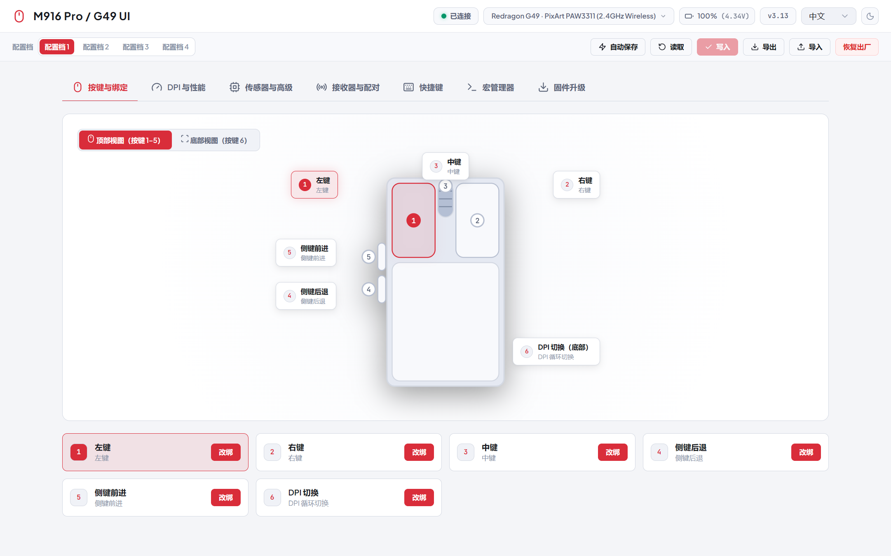
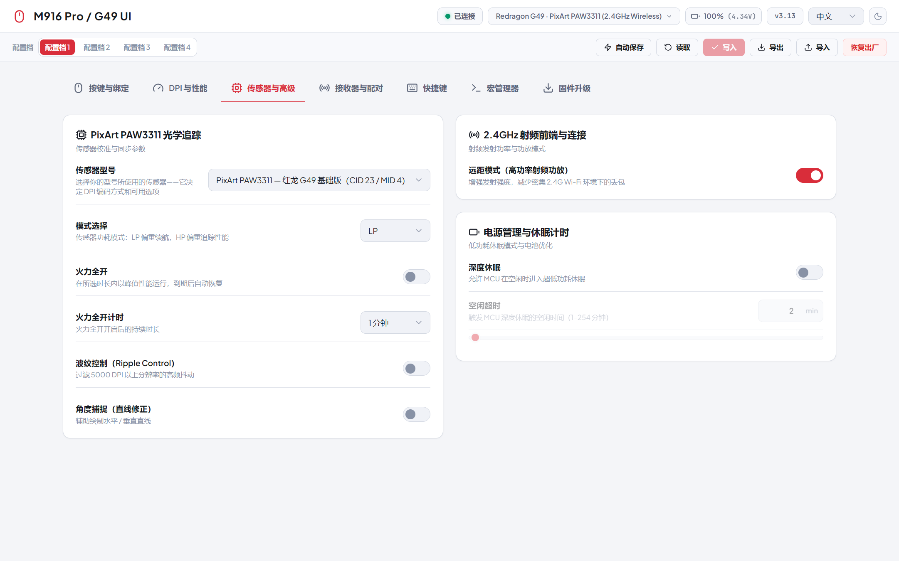

# M916 Pro / G49 UI

**红龙 G49 基础版** 与 **红龙 M916 Pro**（1K / 4K）游戏鼠标的 WebHID 网页配置中心。

[English](README.md) | **中文**

<p align="center">
  
  
</p>

## 支持型号

| 型号 | 传感器 | USB ID (VID:PID) | 板载 MID |
| --- | --- | --- | --- |
| 红龙 G49 基础版 | PixArt **PAW3311** | `3554:F55D`（2.4G 接收器）/ `3554:F5D5`（备用接收器）/ `3554:F55E`（有线） | 4 |
| M916 Pro 1K | PixArt **PAW3395** | 与上方 1K PID 相同 | 5 |
| M916 Pro 4K | PixArt **PAW3395** | `3554:F54C` / `3554:F54F` / `3554:F55F` / `3554:F54E` | 6 |

G49 与 M916 Pro 1K 共用相同的 1K USB ID，但传感器和板载身份不同。应用会自动识别连接的型号（依次尝试：实读 MID → PID 表 → flash 编码证据），也可以在“传感器”面板中手动切换。

## 功能

- **按键映射：** 6 个硬件按键可改绑为鼠标动作、DPI 切换、连发、多媒体键、快捷键或宏
- **DPI 与回报率：** 1-8 档 DPI、逐档颜色、即时切换活动档位，回报率 125 Hz 至 4 kHz
  - PAW3395（M916 Pro）：线性寄存器编码，50–26,000 DPI
  - PAW3311（G49）：量化寄存器码表 50–10,000 DPI，超过后按 ×2/×4 缩放至 24,000 DPI，与官方 G49 驱动的 `driver_sensor.h` 一致
- **传感器调校：** 两款传感器均支持波纹控制与角度捕捉；动态同步（Motion Sync）与 MTK 表面校准仅 PAW3395 型号提供（G49 上为固件占位值，已隐藏）；G49 专属火力全开区块（开关、30 秒–40 分钟计时、LP/HP 模式）
- **电源与射频：** 远距模式、省电模式、休眠计时
- **连接体验：** 点击顶栏设备信息徽章即可在接收器 / 有线之间切换（刷新时始终静默重连上次设备）；2.4G 链路下可实读鼠标与接收器固件版本；可选“自动保存”，停止编辑约 2 秒后自动写入设备
- **宏与快捷键：** 组合键与多步宏录制，存储在板载闪存
- **配置档：** 4 组板载配置档、`.json` 导入导出、恢复出厂
- **固件：** 鼠标与接收器的 USB DFU 升级，含文件头校验和试运行（dry run）模式；接受 G49（MID 4）固件包
- **免安装：** 纯静态 HTML/JS/CSS，无构建步骤；中英双语界面

## G49 适配说明

本项目是 [vzpyr/m916proui](https://github.com/vzpyr/m916proui) 面向红龙 G49 基础版的适配分支。G49 与 M916 Pro 1K 共用 USB ID，但搭载 PAW3311 传感器、寄存器语义不同——上游的 3395 线性编解码会错误解读其 DPI 档位和性能开关。本分支的改动：

- 基于官方 G49 驱动 `SENSOR_3311_DPI_*` 码表实现的传感器感知 DPI 编解码（已与真机 flash 转储逐字节比对验证）
- 3311 固件的性能布尔寄存器按严格 `1` 读取；`0x80`/`0xFF` 等出厂值保持原样不重写，提交时也绝不触碰不支持的 motion-sync 寄存器
- 性能开关在本固件上位于 0xA0+ 区段（直线修正 `0xaf`、波纹 `0xb1`、火力全开 `0xb5`/`0xb7`、模式选择 `0xb9`）——地址来自官方驱动的实际写入抓包
- 版本查询必须使用空载荷（`0x12` 鼠标、`0x1d` 接收器，返回 u16）；单字节载荷只会被原样回显。旧式 `[0x01]` 探测保留为旧版 M916 Pro 固件的兼容回退
- 远距模式经 `0x17` 读取 10 字节报告、`0x16` 写入同样 10 字节载荷——单字节 `[0x01]` 写入会被固件静默忽略
- 配对与固件匹配优先使用实读板载身份（G49 为 MID 4）

## 在线使用

在任意 Chromium 系浏览器（Chrome / Edge / Brave）中直接使用，无需安装：

**[m916-g49-ui.pages.dev](https://m916-g49-ui.pages.dev)**

连接时允许 WebHID 设备弹窗并选择接收器。浏览器权限按域名隔离：即使之前在 localhost 上授权过，在该域名下也需要重新授权一次。

## 快速开始

通过 localhost 启动服务（WebHID 要求安全上下文），并用 Chrome / Edge / Brave 打开：

```bash
python -m http.server 8080
# 打开 http://localhost:8080
```

点击连接后在 WebHID 弹窗中选择接收器。Linux 下需要创建 udev 规则让浏览器访问 HID 接口（WebHID 使用 hidraw），然后重新插拔设备：

```bash
sudo tee /etc/udev/rules.d/99-m916-pro.rules <<'EOF'
SUBSYSTEM=="hidraw", ATTRS{idVendor}=="3554", MODE="0666"
EOF
sudo udevadm control --reload-rules
```

## 维护工具

- `node reference/check-locales.mjs` — 词典一致性检查
- `node reference/verify-g49-codec.mjs` — 基于真实 G49 flash 转储的 DPI 编解码回归测试（将你自己的转储放到 `reference/g49-flash-dump.bin`；本地抓取的转储不入库）
- [SPEC.md](SPEC.md) — 线协议与板载 flash 布局，逆向自官方 Windows 驱动

## 许可证

MIT——见 [LICENSE](LICENSE)（© vzpyr、© dongkid）。

## 致谢

基于 [vzpyr/m916proui](https://github.com/vzpyr/m916proui)（MIT）：原 M916 Pro UI 与 CX52850P 协议基础工作归功于上游作者。G49/PAW3311 适配部分——DPI 编解码、性能寄存器布局、火力全开区块、远距模式与接收器版本查询——由 [dongkid](https://github.com/dongkid) 依据官方 G49 驱动的 `driver_sensor.h`、`Config.ini`、驱动会话日志及真机逐字节实测逆向完成。